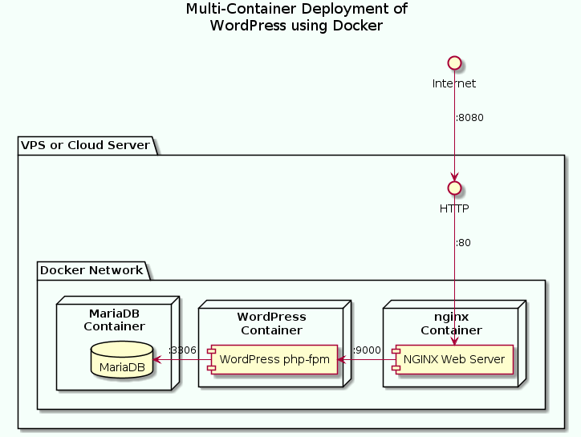
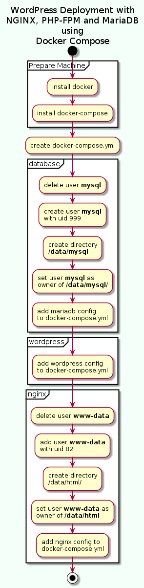

# Docker_WordPress_CMS_Nginx
## WordPress Deployment with NGINX, PHP-FPM and MariaDB using Docker Compose
## WordPress CMS (Content Management System)
- Multi-Container Deployment of WordPress using Docker

- 1  Install Docker in the machine.
- 2 Create a docker-compose.yml file that enables us to create a multi-container deployment.
- 3   Add MariaDB configuration to docker-compose.yml.
- 4  Configure the host machine to handle database files.
- 5    Add WordPress configuration to docker-compose.yml.
- 6    Add a configuration section to nginx.conf file.
- 7   Add NGINX configuration to docker-compose.yml.
- 8   Create the containers and run the services.

- https://medium.com/swlh/wordpress-deployment-with-nginx-php-fpm-and-mariadb-using-docker-compose-55f59e5c1a

